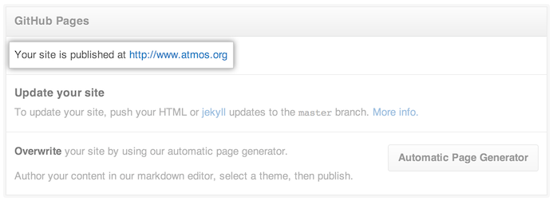

# 添加一个 CNAME 文件到你的存储库中

如果你正在使用一个[自定义域名](custom-domains.md)去重定向你的 GitHub Pages，你必须创建和提交一个包含自定义域名的 *CNAME* 文件到你的 GitHub Pages 存储库中。

1. 在 GitHub，导航到你的页面存储库。
2. 在“分支”菜单中，切换到你存储库的[Pages 分支](https://help.github.com/articles/user-organization-and-project-pages)：  
	- 对于用户和组织的页面站点来说，Pages 分支是 `master` 。
	- 对于项目页面站点来说，Pages 分支是 `gh-pages` 。
3. 添加一个新文件，命名为 *CNAME* （全部大写！），放在 Pages 分支的根目录下。
4. 在新文件中，添加一行，指定自定义域名的空子域名。例如，使用 `blog.example.com` 而不是 `https://blog.example.com` 。请注意，在 *CNAME* 文件中只允许有**一个域名**。
5. 输入提交的消息，或接受默认消息。
6. 在提交消息的对话框底部，点击 **Confirm merge**。

## 确认自定义域名配置正确

1. 在你的存储库右边侧边栏，点击.

2. 在“ GitHub Pages ”底部，你会看到你的 *CNAME* 文件的自定义域名。

## 下一步：配置 DNS 的设置项

在你已经创建和提交你的 *CNAME* 文件到 GitHub 之后，在你的 DNS 提供者上做以下项之一：
	
- 如果你的自定义域是一个[子域名](https://help.github.com/articles/about-custom-domains-for-github-pages-sites#subdomains)（推荐），[配置一个 `CNAME` 记录](https://help.github.com/articles/tips-for-configuring-a-cname-record-with-your-dns-provider)。
- 如果你的自定义域是一个[顶端域名](https://help.github.com/articles/about-custom-domains-for-github-pages-sites#apex-domains)，[配置一个 `ALIAS` , `ANAME` ,或者 `A` 记录](https://help.github.com/articles/tips-for-configuring-an-a-record-with-your-dns-provider)。

## 真实的 *CNAME* 文件例子

[**atmos.github.io repository**](https://github.com/atmos/atmos.github.io/) 有一个域名为 `www.atmos.org` 的 [*CNAME* 文件](https://github.com/atmos/atmos.github.io/blob/master/CNAME)。

- 用户 Pages 站点 [atmos.github.io](http://atmos.github.io/) 定向到 [www.atmos.org](http://www.atmos.org/)。
- 项目 Pages 站点 [atmos.github.io/warden-github](http://atmos.github.io/warden-github/) 定向到 [www.atmos.org](http://www.atmos.org/warden-github/)。

注意项目 Pages 站点如何继承其所有者的用户 Pages 站点的域。

[**emoji repository**](https://github.com/muan/emoji/)有一个域名为 `emoji.muan.co` 的 [*CNAME* 文件](https://github.com/muan/emoji/blob/gh-pages/CNAME)。它归 [**muan**](https://github.com/muan/) 所有，muan 的[用户 Pages 存储库](http://github.com/muan/muan.github.com)有一个域名为 `muan.co` 的 [*CNAME* 文件](https://github.com/muan/muan.github.com/blob/master/CNAME)。

- 项目 Pages 站点 [muan.github.io/emoji](http://muan.github.io/emoji/) 定向到 [muan.co/emoji](http://www.atmos.org/warden-github/)，这对于 [emoji.muan.co](http://emoji.muan.co/) 也同样适用。

## 进一步了解

- “[在 GitHub 页面上设置一个自定义域](set-custom-domains.md)”

